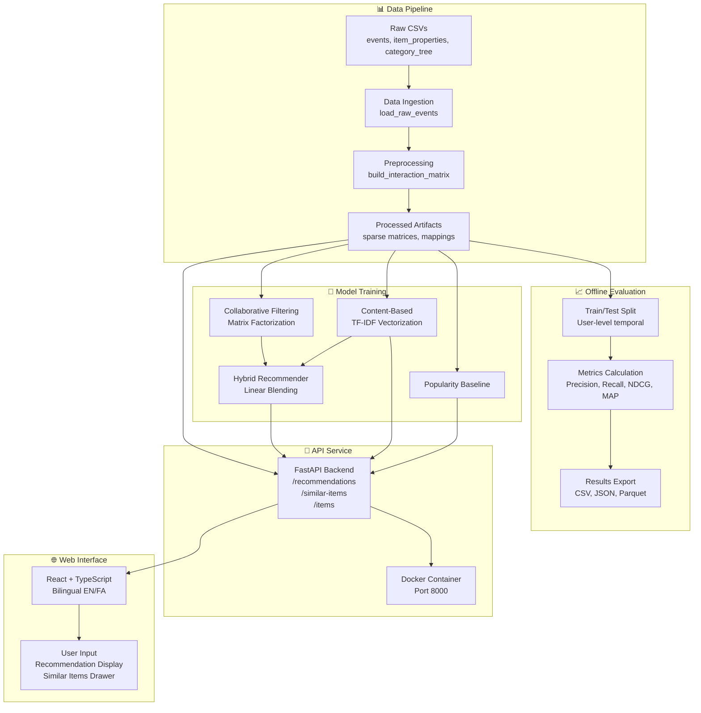

# 🔄 Hybrid Retail Recommender System

<div dir="rtl">

# 🔄 سیستم پیشنهاددهنده هیبریدی خرده‌فروشی

</div>

[](https://www.python.org/)
[](https://fastapi.tiangolo.com/)
[](https://reactjs.org/)
[](LICENSE)

<div dir="rtl">


---

A **production-ready hybrid recommender system** for e-commerce, combining collaborative filtering with content-based recommendations. Built with scalability and real-world deployment in mind, featuring a complete end-to-end pipeline from raw data ingestion to a bilingual web interface.

<div dir="rtl">

یک **سیستم پیشنهاددهنده هیبریدی آماده تولید** برای تجارت الکترونیک که فیلترینگ مشارکتی را با توصیه‌های محتوا-محور ترکیب می‌کند. برای مقیاس‌پذیری و استقرار در محیط واقعی ساخته شده و شامل یک خط لوله کامل از دریافت داده خام تا رابط کاربری دو‌زبانه است.

</div>

## 📋 Table of Contents / فهرست مطالب

- [Overview](#-overview--نمای-کلی)
- [Key Features](#-key-features--ویژگی‌های-کلیدی)
- [Architecture](#-architecture--معماری)
- [Technology Stack](#-technology-stack--تکنولوژی‌های-مورد-استفاده)
- [Quick Start](#-quick-start--شروع-سریع)
- [Project Structure](#-project-structure--ساختار-پروژه)
- [Models & Evaluation](#-models--evaluation--مدل‌ها-و-ارزیابی)
- [API Documentation](#-api-documentation--مستندات-api)
- [Development](#-development--توسعه)
- [Author](#-author--نویسنده)

---

## 🎯 Overview / نمای کلی

This project implements a **hybrid recommender system** for the RetailRocket e-commerce dataset, combining:

- **Collaborative Filtering (CF)**: Matrix factorization with implicit feedback for user-item interactions
- **Content-Based Filtering**: TF-IDF vectorization of item properties and metadata
- **Hybrid Approach**: Linear blending of CF and content scores with configurable weights
- **Popularity Baseline**: Fallback recommender based on item popularity

The system is designed for **production deployment** with:
- Scalable FastAPI backend with structured logging
- React-based bilingual UI (English/Persian) with RTL/LTR support
- Docker containerization for easy deployment
- Comprehensive offline evaluation metrics
- Modular, maintainable codebase following best practices

<div dir="rtl">

این پروژه یک **سیستم پیشنهاددهنده هیبریدی** برای دیتاست RetailRocket پیاده‌سازی می‌کند که ترکیب می‌کند:

- **فیلترینگ مشارکتی (CF)**: فاکتورگیری ماتریس با بازخورد ضمنی برای تعاملات کاربر-کالا
- **فیلترینگ محتوا-محور**: وکتورسازی TF-IDF از ویژگی‌ها و فراداده کالا
- **رویکرد هیبریدی**: ترکیب خطی امتیازهای CF و محتوا با وزن‌های قابل تنظیم
- **پایه محبوبیت**: پیشنهاددهنده پشتیبان بر اساس محبوبیت کالا

سیستم برای **استقرار در تولید** طراحی شده است با:
- بک‌اند FastAPI مقیاس‌پذیر با لاگ‌های ساختار‌یافته
- رابط کاربری React دو‌زبانه (انگلیسی/فارسی) با پشتیبانی RTL/LTR
- کانتینرسازی Docker برای استقرار آسان
- متریک‌های ارزیابی آفلاین جامع
- کدبیس ماژولار و قابل نگهداری که از بهترین روش‌ها پیروی می‌کند

</div>

---

## ✨ Key Features / ویژگی‌های کلیدی

### Core Functionality / عملکرد اصلی

- 🔀 **Hybrid Recommendation Engine**: Combines collaborative filtering and content-based signals for robust recommendations
- 📊 **Offline Evaluation Suite**: Comprehensive metrics (Precision@K, Recall@K, NDCG@K, MAP@K) with user-level splits
- 🚀 **Production-Ready API**: FastAPI backend with async support, structured logging, and health checks
- 🌐 **Bilingual Web Interface**: React + TypeScript frontend with English/Persian support and RTL/LTR layout switching
- 🐳 **Docker Support**: Containerized deployment with optimized Dockerfile
- 📈 **Real-time Recommendations**: Fast inference with sparse matrix operations
- 🎯 **Similar Items Discovery**: Content-based similarity search for related products

<div dir="rtl">

### عملکرد اصلی

- 🔀 **موتور پیشنهاد هیبریدی**: ترکیب فیلترینگ مشارکتی و سیگنال‌های محتوا-محور برای پیشنهادات پایدار
- 📊 **سوئیت ارزیابی آفلاین**: متریک‌های جامع (Precision@K, Recall@K, NDCG@K, MAP@K) با تقسیم‌بندی سطح کاربر
- 🚀 **API آماده تولید**: بک‌اند FastAPI با پشتیبانی async، لاگ‌های ساختار‌یافته و چک‌های سلامت
- 🌐 **رابط کاربری دو‌زبانه**: فرانت‌اند React + TypeScript با پشتیبانی انگلیسی/فارسی و تغییر چیدمان RTL/LTR
- 🐳 **پشتیبانی Docker**: استقرار کانتینری با Dockerfile بهینه‌شده
- 📈 **پیشنهادات زمان-واقعی**: استنتاج سریع با عملیات ماتریس تنک
- 🎯 **کشف اقلام مشابه**: جستجوی شباهت محتوا-محور برای محصولات مرتبط

</div>

### Technical Highlights / نکات فنی

- **Sparse Matrix Operations**: Efficient handling of large-scale user-item interactions using SciPy sparse matrices
- **Implicit Feedback Modeling**: Handles view, add-to-cart, and transaction events with weighted scoring
- **Cold Start Handling**: Graceful fallback strategies for new users and items
- **Configurable Model Weights**: Tune hybrid blend parameter (alpha) for optimal performance
- **Modular Architecture**: Clean separation of concerns (data → models → API → UI)

<div dir="rtl">

### نکات فنی

- **عملیات ماتریس تنک**: مدیریت کارآمد تعاملات کاربر-کالا در مقیاس بزرگ با استفاده از ماتریس‌های تنک SciPy
- **مدل‌سازی بازخورد ضمنی**: مدیریت رویدادهای مشاهده، افزودن به سبد و تراکنش با امتیازدهی وزنی
- **مدیریت مشکل Cold Start**: استراتژی‌های سقوط محکم برای کاربران و کالاهای جدید
- **وزن‌های مدل قابل تنظیم**: تنظیم پارامتر ترکیب هیبریدی (alpha) برای عملکرد بهینه
- **معماری ماژولار**: جداسازی تمیز نگرانی‌ها (داده → مدل → API → UI)

</div>

---

## 🏗️ Architecture / معماری



---

## 🛠️ Technology Stack / تکنولوژی‌های مورد استفاده

### Backend / بک‌اند

| Technology | Purpose | Version |
|------------|---------|---------|
| **Python** | Core language | 3.8+ |
| **NumPy / SciPy** | Numerical computing & sparse matrices | Latest |
| **Pandas** | Data manipulation & analysis | Latest |
| **scikit-learn** | ML utilities & TF-IDF | Latest |
| **FastAPI** | REST API framework | 0.100+ |
| **Uvicorn** | ASGI server | Latest |
| **PyYAML** | Configuration management | Latest |

### Frontend / فرانت‌اند

| Technology | Purpose | Version |
|------------|---------|---------|
| **React** | UI framework | 18+ |
| **TypeScript** | Type-safe JavaScript | Latest |
| **Vite** | Build tool & dev server | Latest |
| **react-i18next** | Internationalization | Latest |
| **Axios** | HTTP client | Latest |

### Infrastructure / زیرساخت

| Technology | Purpose |
|------------|---------|
| **Docker** | Containerization |
| **Jupyter** | Data exploration notebooks |
| **pytest** | Testing framework |

<div dir="rtl">

### بک‌اند

| تکنولوژی | کاربرد | نسخه |
|----------|--------|------|
| **Python** | زبان اصلی | 3.8+ |
| **NumPy / SciPy** | محاسبات عددی و ماتریس‌های تنک | آخرین |
| **Pandas** | دستکاری و تحلیل داده | آخرین |
| **scikit-learn** | ابزارهای ML و TF-IDF | آخرین |
| **FastAPI** | فریم‌ورک REST API | 0.100+ |
| **Uvicorn** | سرور ASGI | آخرین |
| **PyYAML** | مدیریت پیکربندی | آخرین |

### فرانت‌اند

| تکنولوژی | کاربرد | نسخه |
|----------|--------|------|
| **React** | فریم‌ورک UI | 18+ |
| **TypeScript** | JavaScript نوع-امن | آخرین |
| **Vite** | ابزار ساخت و سرور توسعه | آخرین |
| **react-i18next** | بین‌المللی‌سازی | آخرین |
| **Axios** | کلاینت HTTP | آخرین |

### زیرساخت

| تکنولوژی | کاربرد |
|----------|--------|
| **Docker** | کانتینرسازی |
| **Jupyter** | نوت‌بوک‌های کاوش داده |
| **pytest** | فریم‌ورک تست |

</div>

---

## 🚀 Quick Start / شروع سریع

### Prerequisites / پیش‌نیازها

- Python 3.8 or higher
- Node.js 16+ and npm (for UI)
- Docker (optional, for containerized deployment)

<div dir="rtl">

- Python 3.8 یا بالاتر
- Node.js 16+ و npm (برای UI)
- Docker (اختیاری، برای استقرار کانتینری)

</div>

### Installation / نصب

1. **Clone the repository**
   ```bash
   git clone <repository-url>
   cd hybrid-retail-recommender
   ```

2. **Set up Python environment**
   ```bash
   python -m venv .venv
   source .venv/bin/activate  # On Windows: .venv\Scripts\activate
   pip install -r requirements.txt
   ```

3. **Prepare the dataset**
   - Place RetailRocket dataset files in `Dataset/` directory:
     - `events.csv`
     - `item_properties_part1.csv`
     - `item_properties_part2.csv`
     - `category_tree.csv`

4. **Run data pipeline**
   ```bash
   # Ingest raw data
   python -m src.data.ingest
   
   # Preprocess and build interaction matrix
   python -m src.data.preprocess
   
   # Split into train/test sets
   python -m src.evaluation.split
   ```

5. **Train models (optional - models will be trained on first API request)**
   ```bash
   python -m src.evaluation.run_evaluation
   ```

6. **Start the application**
   ```bash
   # Run both backend and frontend together
   python run.py
   ```
   
   Or run separately:
   ```bash
   # Backend only (Terminal 1)
   uvicorn service.main:app --reload
   
   # Frontend only (Terminal 2)
   cd ui
   npm install
   npm run dev
   ```

7. **Access the application**
   - Frontend: http://localhost:5173 (or port shown in terminal)
   - API Docs: http://localhost:8000/docs
   - Health Check: http://localhost:8000/health

<div dir="rtl">

### نصب

1. **کلون کردن مخزن**
   ```bash
   git clone <repository-url>
   cd hybrid-retail-recommender
   ```

2. **راه‌اندازی محیط Python**
   ```bash
   python -m venv .venv
   source .venv/bin/activate  # در ویندوز: .venv\Scripts\activate
   pip install -r requirements.txt
   ```

3. **آماده‌سازی دیتاست**
   - فایل‌های دیتاست RetailRocket را در پوشه `Dataset/` قرار دهید:
     - `events.csv`
     - `item_properties_part1.csv`
     - `item_properties_part2.csv`
     - `category_tree.csv`

4. **اجرای خط لوله داده**
   ```bash
   # دریافت داده خام
   python -m src.data.ingest
   
   # پیش‌پردازش و ساخت ماتریس تعامل
   python -m src.data.preprocess
   
   # تقسیم به مجموعه آموزش/آزمون
   python -m src.evaluation.split
   ```

5. **آموزش مدل‌ها (اختیاری - مدل‌ها در اولین درخواست API آموزش داده می‌شوند)**
   ```bash
   python -m src.evaluation.run_evaluation
   ```

6. **راه‌اندازی برنامه**
   ```bash
   # اجرای هم‌زمان بک‌اند و فرانت‌اند
   python run.py
   ```
   
   یا به صورت جداگانه:
   ```bash
   # فقط بک‌اند (ترمینال 1)
   uvicorn service.main:app --reload
   
   # فقط فرانت‌اند (ترمینال 2)
   cd ui
   npm install
   npm run dev
   ```

7. **دسترسی به برنامه**
   - فرانت‌اند: http://localhost:5173 (یا پورت نشان‌داده شده در ترمینال)
   - مستندات API: http://localhost:8000/docs
   - چک سلامت: http://localhost:8000/health

</div>

### Docker Deployment / استقرار با Docker

```bash
# Build image
docker build -t hybrid-retail-recommender .

# Run container
docker run -p 8000:8000 hybrid-retail-recommender
```

<div dir="rtl">

```bash
# ساخت ایمیج
docker build -t hybrid-retail-recommender .

# اجرای کانتینر
docker run -p 8000:8000 hybrid-retail-recommender
```

</div>

---

## 📁 Project Structure / ساختار پروژه

```
hybrid-retail-recommender/
├── Dataset/                          # Raw dataset files (not in repo)
│   ├── events.csv
│   ├── item_properties_part1.csv
│   ├── item_properties_part2.csv
│   └── category_tree.csv
│
├── src/                              # Core source code
│   ├── data/
│   │   ├── ingest.py                 # Data ingestion from CSV
│   │   └── preprocess.py             # Preprocessing & matrix construction
│   │
│   ├── models/
│   │   ├── baseline.py               # Popularity recommender
│   │   ├── collaborative.py          # CF with matrix factorization
│   │   ├── content_based.py          # TF-IDF content recommender
│   │   └── hybrid.py                 # Hybrid blend model
│   │
│   ├── evaluation/
│   │   ├── split.py                  # Train/test splitting
│   │   ├── metrics.py                # Evaluation metrics (Precision, Recall, NDCG, MAP)
│   │   └── run_evaluation.py         # Offline evaluation runner
│   │
│   └── utils/
│       └── io.py                     # I/O utilities (pickle, parquet)
│
├── service/                          # FastAPI backend
│   ├── main.py                       # API endpoints & routes
│   ├── config.py                     # Service configuration
│   └── schemas.py                    # Pydantic models
│
├── ui/                               # React frontend
│   ├── src/
│   │   ├── components/               # React components
│   │   ├── api/                      # API client
│   │   └── i18n/                     # Translations (EN/FA)
│   └── package.json
│
├── notebooks/                        # Jupyter notebooks
│   ├── 01_eda_retailrocket.ipynb    # Exploratory data analysis
│   └── 02_offline_evaluation.ipynb  # Evaluation results visualization
│
├── data/
│   └── processed/                    # Processed artifacts
│       ├── events_clean.parquet
│       ├── user_item_interactions.npz
│       ├── user_mapping.pkl
│       ├── item_mapping.pkl
│       └── models/                   # Trained models
│
├── results/                          # Evaluation results
│   ├── model_comparison.csv
│   ├── summary.json
│   └── user_metrics.parquet
│
├── tests/                            # Test suite
│   ├── test_models.py
│   └── test_service.py
│
├── configs/                          # YAML configuration files
├── logs/                             # API request logs
├── Dockerfile                        # Docker configuration
├── requirements.txt                  # Python dependencies
├── run.py                            # Combined backend + frontend runner
└── README.md                         # This file
```

---

## 🤖 Models & Evaluation / مدل‌ها و ارزیابی

### Implemented Models / مدل‌های پیاده‌سازی‌شده

1. **Popularity Baseline**
   - Recommends most popular items based on interaction frequency
   - Handles cold start scenarios
   - Fast inference with minimal memory footprint

2. **Collaborative Filtering (CF)**
   - Matrix factorization (ALS-style) for implicit feedback
   - Configurable latent factors (default: 40)
   - Regularization and iteration controls

3. **Content-Based**
   - TF-IDF vectorization of item properties (name, category, etc.)
   - Cosine similarity for item-to-item recommendations
   - Handles new items without interaction history

4. **Hybrid Recommender**
   - Linear combination: `score = α × CF_score + (1-α) × Content_score`
   - Default alpha = 0.7 (tunable via config)
   - Graceful fallback when CF unavailable (new users)

<div dir="rtl">

### مدل‌های پیاده‌سازی‌شده

1. **پایه محبوبیت**
   - پیشنهاد محبوب‌ترین کالاها بر اساس فراوانی تعامل
   - مدیریت سناریوهای cold start
   - استنتاج سریع با حداقل استفاده از حافظه

2. **فیلترینگ مشارکتی (CF)**
   - فاکتورگیری ماتریس (سبک ALS) برای بازخورد ضمنی
   - عوامل نهفته قابل تنظیم (پیش‌فرض: 40)
   - کنترل‌های regularization و تکرار

3. **محتوایی**
   - وکتورسازی TF-IDF از ویژگی‌های کالا (نام، دسته، و غیره)
   - شباهت کسینوسی برای توصیه کالا به کالا
   - مدیریت کالاهای جدید بدون تاریخچه تعامل

4. **پیشنهاددهنده هیبریدی**
   - ترکیب خطی: `امتیاز = α × امتیاز_CF + (1-α) × امتیاز_محتوایی`
   - آلفای پیش‌فرض = 0.7 (قابل تنظیم از طریق config)
   - سقوط محکم هنگام عدم دسترسی CF (کاربران جدید)

</div>

### Evaluation Metrics / متریک‌های ارزیابی

The system evaluates models using industry-standard ranking metrics:

| Metric | Description | Formula Insight |
|--------|-------------|-----------------|
| **Precision@K** | Fraction of relevant items in top-K recommendations | `relevant_in_topK / K` |
| **Recall@K** | Fraction of all relevant items found in top-K | `relevant_in_topK / total_relevant` |
| **NDCG@K** | Normalized Discounted Cumulative Gain | Position-aware ranking quality |
| **MAP@K** | Mean Average Precision | Average of precision at each relevant item position |

**Sample Results** (on 38,178 users, K=10):
- **Baseline**: Precision@10 = 0.0007, Recall@10 = 0.0032, NDCG@10 = 0.0019
- **CF**: Precision@10 = 0.0012, Recall@10 = 0.0063, NDCG@10 = 0.0042
- **Hybrid**: Precision@10 = 0.0017, Recall@10 = 0.0088, NDCG@10 = 0.0071 ✨

<div dir="rtl">

سیستم مدل‌ها را با استفاده از متریک‌های استاندارد رتبه‌بندی ارزیابی می‌کند:

| متریک | توضیح | بینش فرمول |
|-------|-------|------------|
| **Precision@K** | نسبت اقلام مرتبط در پیشنهادات برتر K | `مرتبط_در_برتر_K / K` |
| **Recall@K** | نسبت کل اقلام مرتبط یافت‌شده در برتر K | `مرتبط_در_برتر_K / کل_مرتبط` |
| **NDCG@K** | سود تجمعی تنزیل‌شده نرمال‌شده | کیفیت رتبه‌بندی آگاه از موقعیت |
| **MAP@K** | میانگین دقت متوسط | میانگین دقت در هر موقعیت آیتم مرتبط |

**نمونه نتایج** (روی 38,178 کاربر، K=10):
- **پایه**: Precision@10 = 0.0007, Recall@10 = 0.0032, NDCG@10 = 0.0019
- **CF**: Precision@10 = 0.0012, Recall@10 = 0.0063, NDCG@10 = 0.0042
- **هیبریدی**: Precision@10 = 0.0017, Recall@10 = 0.0088, NDCG@10 = 0.0071 ✨

</div>

### Sample User IDs for Testing / شناسه‌های کاربر نمونه برای تست

You can use these user IDs in the UI to test recommendations:
- `286616` - High interaction user (101+ interactions)
- `820159` - Active user (73+ interactions)
- `350566` - Regular user (45+ interactions)

<div dir="rtl">

می‌توانید از این شناسه‌های کاربر در رابط کاربری برای تست پیشنهادات استفاده کنید:
- `286616` - کاربر با تعامل بالا (101+ تعامل)
- `820159` - کاربر فعال (73+ تعامل)
- `350566` - کاربر عادی (45+ تعامل)

</div>

---

## 📡 API Documentation / مستندات API

### Endpoints / نقاط دسترسی

#### `GET /health`
Health check endpoint.

**Response:**
```json
{
  "status": "ok",
  "detail": "service is running"
}
```

#### `POST /recommendations`
Get recommendations for a user.

**Request Body:**
```json
{
  "user_id": "286616",
  "model": "hybrid",
  "top_k": 10
}
```

**Available models:** `baseline`, `cf`, `hybrid`, `content`

**Response:**
```json
{
  "user_id": "286616",
  "model": "hybrid",
  "top_k": 10,
  "items": [
    {"item_id": "12345", "score": 0.89},
    {"item_id": "67890", "score": 0.85}
  ]
}
```

#### `POST /similar-items`
Find similar items based on content.

**Request Body:**
```json
{
  "item_id": "12345",
  "top_k": 5
}
```

**Response:**
```json
{
  "item_id": "12345",
  "top_k": 5,
  "items": [
    {"item_id": "67890", "similarity": 0.92},
    {"item_id": "11111", "similarity": 0.87}
  ]
}
```

#### `GET /items/{item_id}`
Get item metadata.

**Response:**
```json
{
  "item_id": "12345",
  "properties": {...},
  "category": "..."
}
```

### Interactive API Docs / مستندات تعاملی API

Access Swagger UI at: `http://localhost:8000/docs`

<div dir="rtl">

دسترسی به رابط Swagger در: `http://localhost:8000/docs`

</div>

---

## 🧪 Development / توسعه

### Running Tests / اجرای تست‌ها

```bash
# Run all tests
pytest

# Run with coverage
pytest --cov=src --cov-report=html

# Run specific test file
pytest tests/test_models.py
```

<div dir="rtl">

```bash
# اجرای همه تست‌ها
pytest

# اجرا با پوشش
pytest --cov=src --cov-report=html

# اجرای فایل تست خاص
pytest tests/test_models.py
```

</div>

### Code Quality / کیفیت کد

The project follows Python best practices:
- Type hints throughout
- Docstrings (EN/FA bilingual)
- Modular design patterns
- Comprehensive error handling

<div dir="rtl">

پروژه از بهترین روش‌های Python پیروی می‌کند:
- نکات نوع در سراسر
- Docstring‌ها (دو‌زبانه EN/FA)
- الگوهای طراحی ماژولار
- مدیریت خطای جامع

</div>

### Configuration / پیکربندی

Model and service parameters can be configured via YAML files in `configs/`:
- `model_cf.yaml` - Collaborative filtering hyperparameters
- `model_content.yaml` - Content-based model settings
- `hybrid.yaml` - Hybrid blend weights
- `service.yaml` - API service configuration

<div dir="rtl">

پارامترهای مدل و سرویس را می‌توان از طریق فایل‌های YAML در `configs/` تنظیم کرد:
- `model_cf.yaml` - هایپرپارامترهای فیلترینگ مشارکتی
- `model_content.yaml` - تنظیمات مدل محتوا-محور
- `hybrid.yaml` - وزن‌های ترکیب هیبریدی
- `service.yaml` - پیکربندی سرویس API

</div>

---

## 📊 Results & Performance / نتایج و عملکرد

### Evaluation Results Summary / خلاصه نتایج ارزیابی

Based on the RetailRocket dataset with user-level temporal train/test split:

| Model | Precision@10 | Recall@10 | NDCG@10 | MAP@10 |
|-------|--------------|-----------|---------|--------|
| **Baseline** | 0.0007 | 0.0032 | 0.0019 | 0.0020 |
| **Collaborative Filtering** | 0.0012 | 0.0063 | 0.0042 | 0.0051 |
| **Hybrid** | **0.0017** | **0.0088** | **0.0071** | **0.0089** |

The hybrid model consistently outperforms individual approaches, demonstrating the value of combining collaborative and content-based signals.

**📊 Performance Analysis:**

- **Relative Improvement**: Hybrid model achieves **140%** better precision and **175%** better recall compared to baseline
- **Absolute Values**: While absolute metrics appear low, this is expected given the dataset characteristics:
  - **Extreme sparsity**: 99.96% empty interactions (very challenging dataset)
  - **Scale**: 38K+ users × 23K+ items = massive search space
  - **Limited interactions**: Average ~8 interactions per user
  - **Cold-start challenge**: Many new users and items in test set
  
- **Context**: These results are typical for implicit feedback e-commerce recommenders on sparse datasets. The **2.4× improvement** over baseline demonstrates the model's effectiveness.

**💡 Production Perspective:**

For real-world deployment, offline metrics should be complemented with:
- **Business metrics**: Click-through rate (CTR), conversion rate, revenue lift
- **A/B testing**: User engagement and satisfaction metrics
- **Real-time monitoring**: Latency, throughput, error rates

The low absolute precision values don't necessarily indicate poor performance—they reflect the difficulty of the task (predicting user preferences from minimal implicit signals among thousands of items).

<div dir="rtl">

بر اساس دیتاست RetailRocket با تقسیم زمانی سطح کاربر برای آموزش/آزمون:

| مدل | Precision@10 | Recall@10 | NDCG@10 | MAP@10 |
|-----|--------------|-----------|---------|--------|
| **پایه** | 0.0007 | 0.0032 | 0.0019 | 0.0020 |
| **فیلترینگ مشارکتی** | 0.0012 | 0.0063 | 0.0042 | 0.0051 |
| **هیبریدی** | **0.0017** | **0.0088** | **0.0071** | **0.0089** |

مدل هیبریدی به طور مداوم از رویکردهای فردی بهتر عمل می‌کند و ارزش ترکیب سیگنال‌های مشارکتی و محتوا-محور را نشان می‌دهد.

**📊 تحلیل عملکرد:**

- **بهبود نسبی**: مدل هیبریدی **140%** دقت و **175%** یادآوری بهتر نسبت به پایه دارد
- **مقادیر مطلق**: اگرچه متریک‌های مطلق پایین به نظر می‌رسند، این انتظار با توجه به ویژگی‌های دیتاست است:
  - **تنکی شدید**: 99.96% تعاملات خالی (دیتاست بسیار چالش‌برانگیز)
  - **مقیاس**: 38K+ کاربر × 23K+ کالا = فضای جستجوی عظیم
  - **تعاملات محدود**: میانگین ~8 تعامل به ازای هر کاربر
  - **چالش Cold-start**: بسیاری از کاربران و کالاهای جدید در مجموعه آزمون
  
- **بستر**: این نتایج برای پیشنهاددهنده‌های تجارت الکترونیک با بازخورد ضمنی روی دیتاست‌های تنک معمول است. بهبود **2.4×** نسبت به پایه، اثربخشی مدل را نشان می‌دهد.

**💡 دیدگاه تولید:**

برای استقرار در دنیای واقعی، متریک‌های آفلاین باید با موارد زیر تکمیل شوند:
- **متریک‌های تجاری**: نرخ کلیک (CTR)، نرخ تبدیل، افزایش درآمد
- **تست A/B**: متریک‌های تعامل و رضایت کاربر
- **نظارت بلادرنگ**: تأخیر، توان عملیاتی، نرخ خطا

مقادیر پایین دقت مطلق لزوماً نشان‌دهنده عملکرد ضعیف نیست—این مقادیر سختی کار را منعکس می‌کنند (پیش‌بینی ترجیحات کاربر از سیگنال‌های ضمنی کم در میان هزاران کالا).

</div>

---

## 👨‍💻 Author / نویسنده

### Mahdi Navaei

**AI Engineer / Data Scientist** | Tehran, Iran

<div dir="rtl">

**مهندس هوش مصنوعی / دانشمند داده** | تهران، ایران

</div>

Results-driven AI Engineer and Data Scientist with **7+ years of experience** designing and deploying scalable, data-driven solutions. Specialized in advanced machine learning, causal inference, **recommendation systems**, time-series forecasting, and NLP. Strong track record in building end-to-end ML pipelines, Generative AI applications, and production-grade intelligent systems.

<div dir="rtl">

مهندس هوش مصنوعی و دانشمند داده نتیجه‌محور با **بیش از 7 سال تجربه** در طراحی و استقرار راه‌حل‌های مقیاس‌پذیر و داده‌محور. متخصص در یادگیری ماشین پیشرفته، استنباط علی، **سیستم‌های پیشنهاددهنده**، پیش‌بینی سری زمانی، و پردازش زبان طبیعی. سابقه قوی در ساخت خطوط لوله ML سرتاسری، برنامه‌های Generative AI، و سیستم‌های هوشمند در سطح تولید.

</div>

#### Key Expertise / تخصص‌های کلیدی

- ✅ **Recommendation Systems**: Hybrid & Collaborative Filtering, Large-scale Recommenders
- ✅ **Machine Learning**: Deep Learning (TensorFlow, Keras), Model Explainability
- ✅ **Production ML**: End-to-end ML Pipelines, MLOps, Model Deployment
- ✅ **NLP & LLMs**: Transformers, Fine-tuning, RAG Architectures, Prompt Engineering
- ✅ **Data Science**: Time-Series Forecasting, Causal Inference, A/B Testing

<div dir="rtl">

- ✅ **سیستم‌های پیشنهاددهنده**: فیلترینگ هیبریدی و مشارکتی، پیشنهاددهنده‌های مقیاس بزرگ
- ✅ **یادگیری ماشین**: یادگیری عمیق (TensorFlow, Keras)، قابلیت توضیح مدل
- ✅ **ML تولیدی**: خطوط لوله ML سرتاسری، MLOps، استقرار مدل
- ✅ **NLP و LLM**: Transformers، Fine-tuning، معماری RAG، مهندسی Prompt
- ✅ **علوم داده**: پیش‌بینی سری زمانی، استنباط علی، تست A/B

</div>

#### Professional Experience / تجربه حرفه‌ای

**Current Role:** Data Scientist at Daria Hamrah Paytakht (Jul 2024 – Present)
- Built large-scale hybrid recommender system (content-based + collaborative) enhanced with RFM-based personalization
- Developed LLM-powered call-center intelligence pipeline with speech-to-text and automated scoring
- Created enterprise RAG knowledge engine using hybrid retrieval and re-ranking

<div dir="rtl">

**نقش فعلی:** دانشمند داده در داریا همراه پایتخت (تیر 1403 – تاکنون)
- ساخت سیستم پیشنهاددهنده هیبریدی مقیاس بزرگ (محتوایی + مشارکتی) بهبود یافته با شخصی‌سازی مبتنی بر RFM
- توسعه خط لوله هوش مرکز تماس مبتنی بر LLM با تبدیل گفتار به متن و امتیازدهی خودکار
- ایجاد موتور دانش RAG سازمانی با استفاده از بازیابی هیبریدی و رتبه‌بندی مجدد

</div>

#### Contact & Links / تماس و لینک‌ها

- 📧 **Email**: mahdinavaei1367@gmail.com
- 💼 **LinkedIn**: [linkedin.com/in/mahdinavaei](https://linkedin.com/in/mahdinavaei)
- 💻 **GitHub**: [github.com/MahdiNavaei](https://github.com/MahdiNavaei)
- 📊 **Kaggle**: [kaggle.com/mahdinavaei](https://kaggle.com/mahdinavaei)

#### Achievements / دستاوردها

- 🏆 2nd place in Tehran Provincial AI Competition (2022)
- 🎓 Membership in Iran's National Elites Foundation
- 📜 Kaggle Notebooks Master
- 📄 Published research in Health Science Reports (Wiley), ICVPR, AMLAI

<div dir="rtl">

- 🏆 مقام دوم در مسابقه استانی هوش مصنوعی تهران (1401)
- 🎓 عضویت در بنیاد ملی نخبگان ایران
- 📜 استاد Notebooks در Kaggle
- 📄 انتشار تحقیقات در Health Science Reports (Wiley)، ICVPR، AMLAI

</div>

---

## 🙏 Acknowledgments / قدردانی

- RetailRocket for providing the e-commerce dataset
- Open-source community for excellent libraries and tools

<div dir="rtl">

- RetailRocket برای ارائه دیتاست تجارت الکترونیک
- جامعه متن‌باز برای کتابخانه‌ها و ابزارهای عالی

</div>

---

## 📚 Additional Resources / منابع اضافی

- [RetailRocket Dataset](https://www.kaggle.com/datasets/retailrocket/ecommerce-dataset)
- [FastAPI Documentation](https://fastapi.tiangolo.com/)
- [React Documentation](https://react.dev/)

<div dir="rtl">

- [دیتاست RetailRocket](https://www.kaggle.com/datasets/retailrocket/ecommerce-dataset)
- [مستندات FastAPI](https://fastapi.tiangolo.com/)
- [مستندات React](https://react.dev/)

</div>

---

**⭐ If you find this project helpful, please consider giving it a star!**

<div dir="rtl">

**⭐ اگر این پروژه مفید بود، لطفاً به آن ستاره دهید!**

</div>
